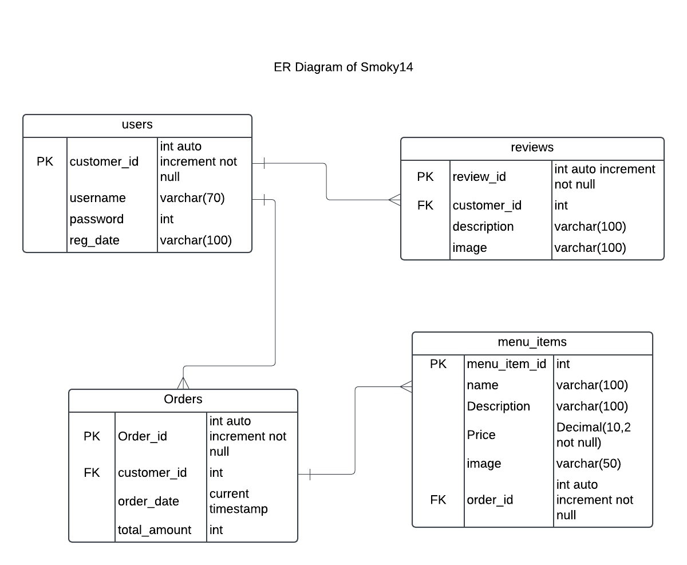

# Project Name: WebProgrammingProject - Team Number: 14

## Project Overview
This project is part of our Web Programming course, where we apply our skills to enhance a database-driven website. The website builds upon our previous "Website User Interface" course and follows the SCRUM development methodology, ensuring continuous progress with weekly demonstrations.

## Table of Contents
- [Features](#features)
- [Database Tables](#database-tables)
- [Created Forms](#created-forms)
- [Created Tables](#created-tables)

---

## Features Implemented

- [ ] Feature 1 (Database Integration): Our website is powered by a MySQL database, with each team member responsible for at least one table.. 
- [ ] Feature 2 (CRUD Functionality): Users can create, read, update, and delete data dynamically on the website. Admin features are protected using .htaccess.
- [ ] Feature 3 (JavaScript Validation): Forms include client-side validation to improve data integrity.
- [ ] Feature 4 (JavaScript Event Handlers): Interactive elements enhance the user experience.

### Feature 1: Database Integration

Our website is powered by a MySQL database, designed to store and manage data dynamically. Each team member is responsible for at least one table, ensuring a structured and well-organized database schema. The database follows a relational design, allowing efficient data retrieval and manipulation.

## Database Structure:

Tables are designed based on project requirements, including necessary relationships between them.
The database schema is generated using PhpMyAdmin and stored in the project repository.

## Technologies Used:

- MySQL for data storage
- PHP for backend interaction with the database
- PhpMyAdmin for database management

## Key Functionalities:

- Storing and retrieving user-generated content
- Managing relationships between tables
- Ensuring data integrity with proper constraints (e.g., primary keys, foreign keys)

Provide links to related code files (github) & link to the feature (shell.hamk.fi) .

### Feature 2 :CRUD Functionality
Our website supports full CRUD (Create, Read, Update, Delete) operations, enabling dynamic content management. These functionalities allow users to interact with the database efficiently.

- Create: Users can submit data via forms, which is then stored in the database.

- Read: Data is retrieved and displayed dynamically on the website.

- Update: Users can modify existing records through editable forms.

- Delete: Data can be removed securely using a delete function.

## Security Measures:

- SQL queries are prepared statements to prevent SQL injection.
- Admin panel is protected using .htaccess authentication.
- User inputs are validated to ensure data integrity.

## Technologies Used:

- PHP for server-side scripting
- MySQL for data storage and retrieval
- HTML & JavaScript for front-end forms

Provide links to related code files (github) & link to the feature (shell.hamk.fi) .

### Feature 3 : JavaScript Validation
Client-side validation is implemented to improve data integrity and enhance the user experience by preventing incorrect form submissions. JavaScript validation ensures that only properly formatted data is sent to the server.

## Validation Rules Implemented:

- Required fields must be filled before submission.
- Email addresses must follow a valid email format (example@domain.com).
- Password fields require a minimum length and a combination of characters.
- Numeric fields allow only valid number inputs.

## Real-Time Feedback:

- Error messages appear dynamically as users fill out the form.
- Fields are highlighted when invalid inputs are detected.
- Users cannot submit the form until all required fields meet the criteria.

## Technologies Used:

- JavaScript for event handling
- Regular expressions (Regex) for pattern matching
- HTML5 form validation attributes for basic checks

Provide links to related code files (github) & link to the feature (shell.hamk.fi).

### Feature 4 : JavaScript Event Handlers

Interactive JavaScript event handlers are implemented to improve user engagement and provide a responsive web experience. These event handlers trigger specific actions based on user interactions.

## Implemented Event Handlers:

- Button Click Events: Execute functions when users click buttons (e.g., submitting a form, showing/hiding content).
- Form Input Events: Provide real-time feedback when users type or change field values.
- Mouse Hover Events: Trigger animations or display tooltips when users hover over elements.
- Keyboard Events: Capture and process user input, such as detecting keypresses in search fields.

## Technologies Used:

- JavaScript for dynamic interaction
- Event listeners (click, mouseover, keyup, etc.)
- CSS for visual effects triggered by events

---

## Database Tables

List of the database tables that are part of our project: 

- Table 1 (Created By Mustafa): Customers 
- Table 2 (Created By Muntasir): Orders 
- Table 3 (Created By Firoz): Order_Items
- Table 4 (Created By Sohaib): Customer_Review

 

---

## Created Forms

List and describe any forms that have been created as part of your project. Include details about the purpose of each form and any validation logic.

- Form 1 (Created By Mustafa): Form Name: Link to the related code file (github) | Link to the form (shell.hamk.fi). | Validations Applied

- Form 2: (Created By Muntasir): Form Name: Orders (Order History) & Admin
https://github.com/abostef747/Group14_Webprogramming/blob/main/src/orders.php 
https://github.com/abostef747/Group14_Webprogramming/blob/main/src/admin.php
| http://shell.hamk.fi/~amk1004807/group14/orders.php 
http://shell.hamk.fi/~amk1004807/group14/admin.php
| Validations Applied (Javascript)

- Form 3: (Created By Firoz): Form Name: Link to the related code file (github) | Link to the form (shell.hamk.fi).  | Validations Applied
- Form 4: (Created By Sohaib): Form Name: Link to the related code file (github) | Link to the form (shell.hamk.fi).  | Validations Applied

---

## Created Tables

List any tables that you have created in the project work

- Table 1 (Created By Mustafa): Table Name | Link to the related code file (github) | Link to the table (shell.hamk.fi).

- Table 2 (Created By Muntasir): Table Name : Orders | 
https://github.com/abostef747/Group14_Webprogramming/blob/main/src/orders.php  
| http://shell.hamk.fi/~amk1004807/group14/orders.php 

- Table 3 (Created By Firoz): Table Name | Link to the related code file (github) | Link to the table (shell.hamk.fi).
- Table 4 (Created By Sohaib): Table Name | Link to the related code file (github) | Link to the table (shell.hamk.fi).

---

